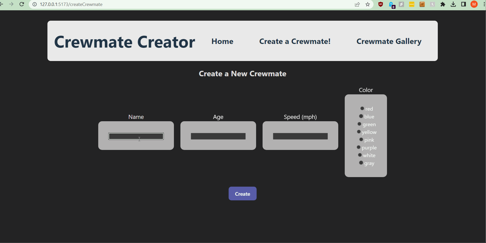

# Web Development Project 7 - *Crewmates*

Submitted by: **Muhib Sheikh**

This web app: **A web app that allows users to creates and update crewmates**

Time spent: **7** hours spent in total

## Required Features

The following **required** functionality is completed:

- [X] **A create form allows users to add new cremates**
- [X] **Users can name the crewmate and set the crewmate's attributes by clicking on one of several values**
- [X] **The site displays a summary page of all the user's added crewmates**
- [X] **A previously created crewmate can be updated and deleted from the crewmate list**
- [X] **Each crewmate has a direct, unique link to an info page about them**

## Video Walkthrough

Here's a walkthrough of implemented user stories:

<!-- Replace this with whatever GIF tool you used! -->
GIF created with [Licecap](https://www.cockos.com/licecap/) for Windows/mac  
<!-- Recommended tools:
[Kap](https://getkap.co/) for macOS
[ScreenToGif](https://www.screentogif.com/) for Windows
[peek](https://github.com/phw/peek) for Linux. -->

## Notes

The main issues were the CSS and getting the API to work correctly with the database and getting the response I expected.

## License

    Copyright [2023] [Muhib Sheikh]

    Licensed under the Apache License, Version 2.0 (the "License");
    you may not use this file except in compliance with the License.
    You may obtain a copy of the License at

        http://www.apache.org/licenses/LICENSE-2.0

    Unless required by applicable law or agreed to in writing, software
    distributed under the License is distributed on an "AS IS" BASIS,
    WITHOUT WARRANTIES OR CONDITIONS OF ANY KIND, either express or implied.
    See the License for the specific language governing permissions and
    limitations under the License.